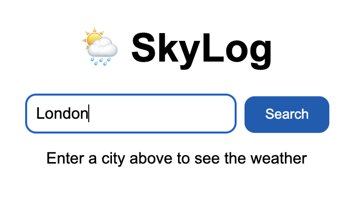
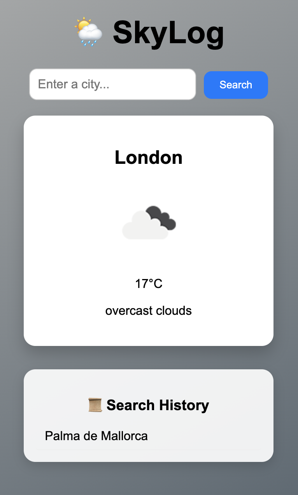

# 🌦 SkyLog

<table>
  <tr>
    <td width="50%" align="center">
      
    </td>
    <td width="50%">
      <p>
        <b>SkyLog</b> is a weather-powered daily journal.<br>
        It lets you check live forecasts, write personal notes, and revisit your climate history — all in one simple app.
      </p>
    </td>
  </tr>
</table>

## ✨ Features
- 🔍 Search real-time weather by city (OpenWeather API)  
- 📝 Add personal notes linked to weather conditions  
- 📜 View your history of past searches  
- ⚛️ Full-stack app: React (frontend) + FastAPI (backend)  

## 🖥️ Tech Stack
- **Frontend:** React + Vite (+ Tailwind optional)  
- **Backend:** FastAPI, Uvicorn, Requests  
- **Data Storage:** JSON (can be upgraded to SQLite)  
- **API:** OpenWeatherMap  

## ⚙️ Prerequisites
- Python 3.10+  
- Node.js 20+ & npm 9+ (for frontend)  
- Optional: Conda environment 

## Demos

<p align="center">
  <em>1. Home page with the search field filled in — ready to look for the weather for your chosen city.</em>
  <br>
</p>
<p align="center">
  <em>2. After searching: view live weather details and your recent search history.</em>
  <br>
</p>

## 📂 Project Structure
```
SkyLog/
│
├── backend/
│   ├── app.py                  # FastAPI backend code
│   ├── requirements.txt        # Python dependencies
│   ├── data.json               # Storage for user entries / weather history
│   ├── .env.example            # Example API key environment file
│
├── frontend/
│   ├── index.html              # Vite entry HTML
│   ├── package.json            # Frontend dependencies and scripts
│   ├── vite.config.js          # Optional Vite config
│   ├── src/
│   │   ├── main.jsx            # React entry point
│   │   ├── index.css           # Global CSS
│   │   ├── App.jsx             # Main React component
│   │   └── components/
│   │       └── WeatherCard.jsx # Example weather card component
│
├── .gitignore                  # Ignore node_modules, .env, etc.
└── README.md                   # Full project instructions

```

## 🔧 Setup Instructions

### Option 1: Using Conda (recommended)
1. Create and activate environment:
```bash
conda create -n skylog python=3.11
conda activate skylog
```
2. Backend setup:
```bash
cd backend
pip install -r requirements.txt
uvicorn app:app --reload
```
> Runs FastAPI backend at `http://127.0.0.1:8000`.

3. Install modern Node.js - version 20 recommended (first time only):
```bash
conda install -c conda-forge nodejs=20
```
> ⚠️ Node.js 14+ is required for Vite and esbuild. Using older versions may cause installation errors.

4. Frontend setup:
```bash
cd ../frontend
npm install
npm run dev
```
> Frontend runs at `http://localhost:5173`.

### Option 2: Without Conda
1. Install Python 3.10+ and pip.  
2. Backend:
```bash
cd backend
pip install -r requirements.txt
uvicorn app:app --reload
```
3. Install Node.js 20+ & npm 9+ [Homebrew](https://brew.sh/) or [Node website](https://nodejs.org/).  
4. Frontend:
```bash
cd frontend
npm install
npm run dev
```

## 🌐 Environment Variables
1. Copy `.env.example` to `.env` in the backend folder:
```bash
cd backend
cp .env.example .env
```
2. Add your OpenWeather API key:
```env
OPENWEATHER_API_KEY=your_real_api_key_here
```
> `.env` is ignored by Git for security.

## 🚀 Running the App
- Start backend:
```bash
cd backendz
uvicorn app:app --reload
```
- Start frontend:
```bash
cd frontend
npm run dev
```
- Open browser at [http://localhost:5173](http://localhost:5173)

## 📜 License
This project is open source and available under the [MIT License](LICENSE).
